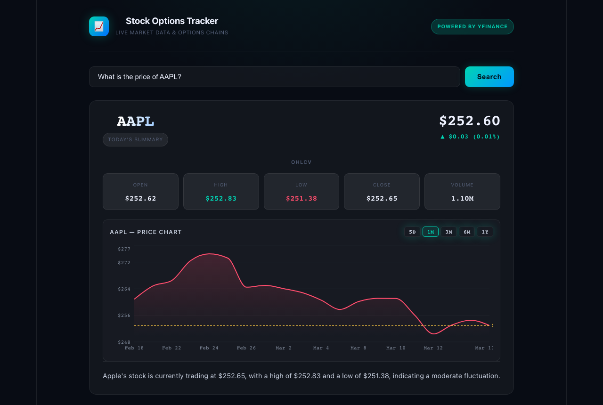

# Stock Options Tracker

A full-stack AI-powered stock and options research tool. Ask natural language questions — by ticker symbol or company name — about stock prices, options chains, and price history. A local AI orchestrator routes your query to the right agent, fetches live data via Yahoo Finance, and returns a formatted response with charts.

---

## Preview



---

## Architecture Flow

See [`architecture.mmd`](architecture.mmd) for the full Mermaid source.

---

## Tech Stack

| Layer          | Technology                                           |
| -------------- | ---------------------------------------------------- |
| Frontend       | React 19 + Vite + Recharts                           |
| Backend API    | FastAPI + Uvicorn                                    |
| Orchestration  | `OrchestratorAgent` — `phi4-mini` (Ollama)           |
| Finance Agent  | `FinanceAgent` — `llama3.2` (Ollama)                 |
| Data Tools     | MCP server via `FastMCP` (stdio transport)           |
| Market Data    | `yfinance`, `pandas`                                 |
| AI Runtime     | Ollama (local, no API key required)                  |
| Stock Mappings | `app/data/stock_mappings.py` — 100+ company → ticker |

---

## Project Structure

```
.
├── app/
│   ├── main.py                   # FastAPI app + CORS
│   ├── routers/
│   │   └── chat.py               # POST /chat endpoint
│   ├── agents/
│   │   ├── base_agent.py         # Abstract BaseAgent interface
│   │   ├── orchestrator_agent.py # Routing + intent detection (phi4-mini)
│   │   └── finance_agent.py      # Data fetching + formatting (llama3.2)
│   ├── data/
│   │   ├── __init__.py
│   │   └── stock_mappings.py     # COMPANY_NAME_MAP, TICKER_GROUPS (Mag7, FAANG, etc.)
│   └── mcp/
│       └── server.py             # MCP tools: get_stock_info, get_options, get_stock_history
└── client/
    └── src/
        ├── App.jsx               # React UI — charts, options chain, multi-stock table
        ├── App.css               # Dark Bloomberg-style theme
        └── index.css             # Global dark background
```

---

## Agent Pattern

The system uses an **Orchestrator → Specialist Agent** pattern:

1. **OrchestratorAgent** receives the raw user message and determines intent:
   - **Name resolution** — company names (e.g. `"Apple"`, `"Palantir"`, `"AppLovin"`) are resolved to tickers before any routing using `COMPANY_NAME_MAP` (100+ entries) from `app/data/stock_mappings.py`.
   - **Fast path** — regex instantly detects ticker + options/price keywords (no LLM call). Handles both `"AAPL options"` and `"options for AAPL"` word orders.
   - **Slow path** — `phi4-mini` classifies ambiguous queries and returns structured `{agent, action, params}` JSON.
2. **FinanceAgent** is dispatched with `(action, params)`:
   - Calls the MCP stdio server as a subprocess.
   - For **price queries**: concurrently fetches `get_stock_info` + `get_stock_history` (1 month by default), attaches history to the stock dict, and uses `llama3.2` to compose a natural-language summary.
   - For **options queries**: fetches `get_options`, defaults to the next Friday expiry and snaps to the nearest available date. Formats a strike/price/volume table. Filters strikes within ±10% of current price.
   - For **multi-stock queries**: fetches all tickers concurrently.
   - Returns `{"response": str, "stock": dict|None, "stocks": list|None, "options": dict|None}`.
3. **OrchestratorAgent** forwards the full result dict to the API router.

### MCP Tools

| Tool                | Params                               | Returns                                                    |
| ------------------- | ------------------------------------ | ---------------------------------------------------------- |
| `get_stock_info`    | `ticker`                             | current price + today's OHLCV as JSON                      |
| `get_options`       | `ticker`, `expiry_date` (YYYY-MM-DD) | puts + calls within ±10% of current price; auto-snaps date |
| `get_stock_history` | `ticker`, `period` (default `1mo`)   | array of `{date, open, high, low, close, volume}` records  |

### Frontend Features

- **Dark terminal-inspired UI** — Bloomberg-style theme with glassmorphism and gradient accents.
- **Price chart** — interactive `AreaChart` (recharts) with period tabs (5D / 1M / 3M / 6M / 1Y), custom OHLCV tooltip, dashed reference line at current price, teal/red coloring based on direction.
- **OHLCV stat grid** — Open, High, Low, Close, Volume tiles.
- **Options chain** — side-by-side PUTS/CALLS tables with current-price marker row and nearest-strike highlight.
- **Multi-stock table** — sortable table for basket/group queries (Mag 7, FAANG, etc.).

---

## Setup

### Prerequisites

- Python 3.11+
- Node.js 18+
- [Ollama](https://ollama.com) running locally with the following models pulled:
  ```bash
  ollama pull phi4-mini
  ollama pull llama3.2
  ```

### Backend

```bash
python -m venv .venv
source .venv/bin/activate        # Windows: .venv\Scripts\activate
pip install -r requirements.txt
uvicorn app.main:app --port 8000 --reload
```

### Frontend

```bash
cd client
npm install
npm run dev
```

Open [http://localhost:5173](http://localhost:5173).

---

## Example Queries

**Stock prices**

- `What is the price of AAPL?`
- `How is Palantir trading today?`
- `NVDA stock price`

**Options chains**

- `Show me PLTR options for 03/20/2026`
- `TSLA options expiring 2026-03-21`
- `APP options chain` _(AppLovin — not Apple)_
- `Palo Alto Networks options`

**Multi-stock baskets**

- `Show me Mag 7 stocks`
- `FAANG prices`
- `Compare AAPL MSFT GOOGL`
